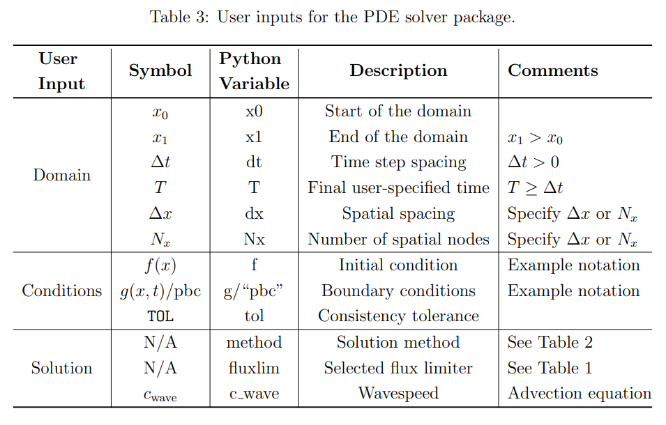
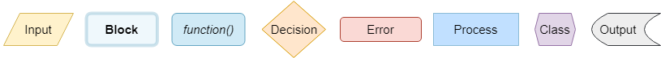
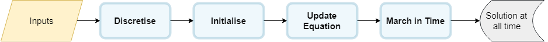
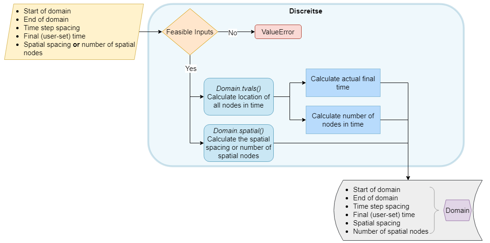
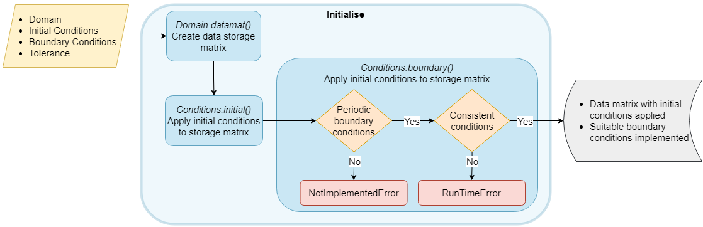
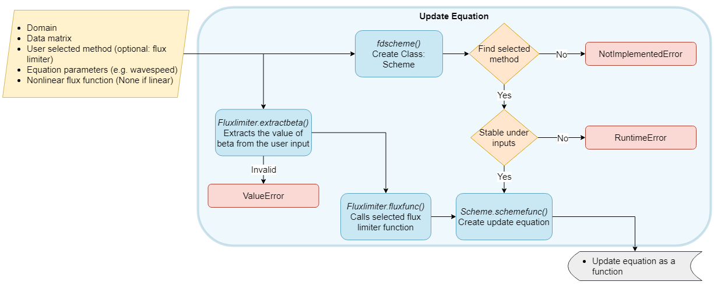
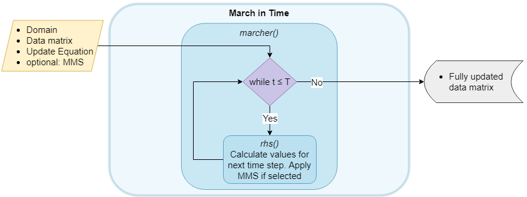
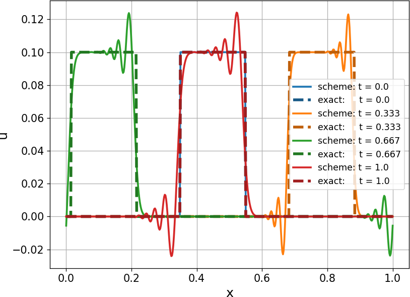
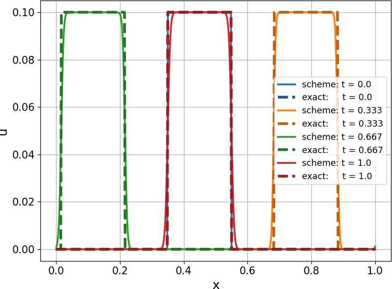

# README for Repository - PDE Solver Package

This repository provides a python package to solve some partial differential equations (PDEs) under specified conditions. The instructions on how to install and use this work is detailed below.

# Installation
The package may be installed from the command line (or virtual environment setting) using `pip install {path/to/package}/py_scicomp_package` or otherwise.

# Repository Explanation

It is important to provide a clear documentation of our software package. This not only enables the developer to have a structured overview, but also allows external contributors and users to understand the process 'behind the scenes'. The structure of the software package is designed such that each process is separated and no/as little as possible code is duplicated. This former ideology is known as 'separation of concerns'.

## User Inputs


The developed Python code is designed to take user inputs and present the output of the PDE under these input conditions. The aim is for the user to do as little as possible with any errors clearly displayed. We still stick to the linear advection equation and Burgers' equation for examples of linear and nonlinear cases. The table below presents the expected inputs.




## Package Structure

The package is constructed to follow conventions of a standard Python package. The structure of the directory tree may be found below. The ST_Python file is the GitHub repository.


|— py_scicomp_package<br />
|—— pde_solver<br />
|——— __ init __.py<br />
|——— solver<br />
|———— __ init __.py<br />
|———— conditions.py<br />
|———— domain.py<br />
|———— fluxlimiters.py<br />
|———— solvers.py<br />
|——— examples<br />
|———— example_advection.py<br />
|———— example_burgers.py<br />
|———— example_burgers_trafficflow.py<br />
|——— tests<br />
|———— unittests_conditions.py<br />
|———— unittests_discretise.py<br />
|———— unittests_solver.py<br />
|———— systemtests_advection_mms.py<br />
|———— systemtests_burgers_mms.py<br />
|———— systemtests_convergence_dx.py<br />
|———— systemtests_convergence_dt.py<br />
|—— setup.py<br />


## Code Flow


Now that the inputs and the package directory structure have been explained, the flow of the solution method may be detailed. However, first, the flow chart shapes must be clarified. This is presented in the figure below.



The overarching goal is to present the solution of the PDE on the (user-specified) domain with the (user-specified) initial and boundary conditions using the (user-specified) solution method. The main structure consists of four steps as can be seen in the figure below.




We now examine each step in closer detail.

## Discretisation

The discretisation flow is presented in the figure below. User inputs are required to define the domain. Careful attention is paid to the specification of Δx and N_x. Only one of these may be specified to avoid contradiction unless they are consistent. In the case of a contradiction or insufficient information, a `ValueError` is produced. This flow forms the class: Domain. Domain contains all the necessary information about the domain and is used frequently in other functions. 




## Initialisation


The initialisation flow refers to the creation of a storage matrix with the appropriate initial and boundary conditions. This matrix will eventually contain the solution at every time step (each column). This is created using the _datamat()_ function from the Domain class. The initial conditions are then implemented for the 0th time step (t = 0). This corresponds to the first column of the data matrix. Thereafter, the boundary conditions are applied. Two checks are made. First, a `NotImplementedError` is raised if non-periodic boundary conditions are input. A `RunTimeError` is produced if the input conditions are not consistent with periodicity at the boundaries. This occurs if |f(x_0) - f(x_1)| >=  `TOL`. This flow is presented the figure below.





## Update Equation

The update equation is a function that is created to provide the solution at time step n+1, given the solution to time step n. This is the sole required input, however, to create the function further information is required (see the figure below). 



First, the class: Scheme is created. This class contains the methods that may be used. An overview is presented in the table below. If the selected method is not found then, then a `NotImplementedError` is produced. Furthermore, if the selected method is unstable given the input parameters, a `RuntimeError` occurs. The appropriate stability requirements are taken from Numerical Methods for Conservation Laws: From Analysis
to Algorithms by J S Hesthaven. A successful method input creates a function which requires just the index of the previous time step in the data matrix. The method also incorporates a flux limiter (if selected) which is implemented from the Fluxlimiter class using _Fluxlimiter.fluxfunc()_. The user must input the flux limiter name as a string with the value of \beta (flux limiter parameter) appended after an underscore, e.g. `fluxlimiter="sweby_0 -----"`. The _Fluxlimiter.extractbeta()_ function performs input checks and extracts the value of β. An input for β is neglected if appended to a flux limiter for which the variable is not required.


## Time Marching


Finally, the time marching flow is presented in the figure below. Given the inputs, the function _marcher()_ progresses through time, calculating and storing the function value at each time step until the final time step is reached. The full storage data matrix may then be used for analysis and plotting. The method of manufactured solutions (MMS) may be implemented here by inputting an MMS source term.




The final data storage matrix is input into the class: Soln which allows for direct plotting against the exact solution using _Soln.plot()_ if the solution is known.

# Further details

The importance of clear structure and documentation is not to be underestimated. All functions within the package include a docstring description. For high-level functions, their inputs and outputs are listed. Where relevant, the raised errors are also documented. Furthermore, print statements are occasionally used to indicate to the user which scheme has been selected. This serves to confirm the user has correctly input the intended method. Additionally, the progress of the solver is shown in the console. From the user perspective, this gives an indication of waiting time.

A few notes on the code style are now made. Firstly, inheritance was considered but not implemented due to the very modular structure of the code flow. Secondly, the code was developed in such a way as to allow for a high degree of flexibility and further development avoiding 'hard coding' where possible. An example to highlight this can be found in the _marcher()_ function in which the function _rhs()_ is called to update the solution passing each time step. Any suitable scheme may be added by changing the _rhs()_ function. Not only does this increase simplicity of the code, but it allows for errors to be found more easily. While not required for this report, this function does also support an input for time. Thirdly, rather than calling a function, which calls another function (and so on), where possible, a function object is returned. This requires one 'initialisation run' rather than creating the scheme every time the function is required, improving code efficiency. Lastly, the use of `__str__` within classes has been implemented, where relevant, for user use and debugging efforts.

# Implementation and Example Script

In order to solve the selected PDE, the required functions (initial, boundary and/or exact) must be defined. First, the domain must be initialised. This is achieved through the use of the Domain class as follows: `Domain`(x_0, x_1, Δt, T, Δx). Note that N_x may be specified instead of Δx. Secondly, the initial and boundary condition functions must be specified for the solver. This can be achieved using `Conditions`(initial, boundary - this is "pbc" for periodic boundary conditions, `TOL`) where the tolerance parameter is optional and set to `TOL` = 1e-8 when not specified. The equation may now be solved by applying the function _{PDE}_eqn_solve(_Domain, Conditions, method, optional: fluxlim, equation parameters_)_ where _{PDE}_ must be replaced by _advection_ or _burgers_. The solution may now be plotted using `Sol.plot`(number of curves, exact function) where `Sol` is the class returned from the solving function. The curves are shown at evenly spaced time intervals. The corresponding exact function may be optionally input as the second argument if it is known. The advantage of the solution as a class (Sol) is the ease at which the aforementioned plot may be constructed. 

A very brief example script is presented for the linear advection equation. Due to space limitations, spacings and function docstrings have been shortened. This script and more may be found under the 'examples' directory within the package.


```
from pde_solver.solver import Domain, Conditions, advection_eqn_solve
import numpy as np

def f(x):
    """Square initial condition."""
    IC = 0 * x
    IC[int(len(IC)*0.35):int(len(IC)*0.55)] = 1
    return IC

def exactfunc(x, t):
    """Exact solution is shifted initial conditions: f(x - c t)."""
    n = int((c_wave*t*Grid.Nx)%Grid.Nx)
    return np.hstack((f(x)[-n:], f(x)[:-n]))

c_wave = 1  # Wavespeed

Grid = Domain(0, 1, 0.001, 1, dx=0.01)  # Domain specifications
Conds = Conditions(f, "pbc")  # Initial and boundary conditions
Sol = advection_eqn_solve(Grid, Conds, method="lwm", c=c_wave)  # Solve with specified method
Sol.plot(5, exactfunc)  # Plots (at 5 evenly spaced time intervals with corresponding exact solution)
```


The initial condition is represented by f(x) and so the exact solution is known as f(x - c_(wave) t) which is the shifted initial condition). The Domain class is initialised as `Grid` in line 17, followed by the initial and (periodic) boundary conditions in line 18 with `Conds`. The solution is then returned as a class (`Sol`) from the function _advection_eqn_solve()_ (line 19). The required inputs are input within the parentheses. Finally, a plot results from line 20. The result obtained is presented in the figure below.



With a flux limiter added in parenthesis in line 19, in this case, using `fluxlim="vanleer"`, it can be seen in the figure below how the oscillations are clearly dampened.


